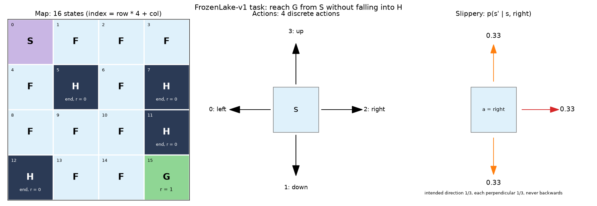
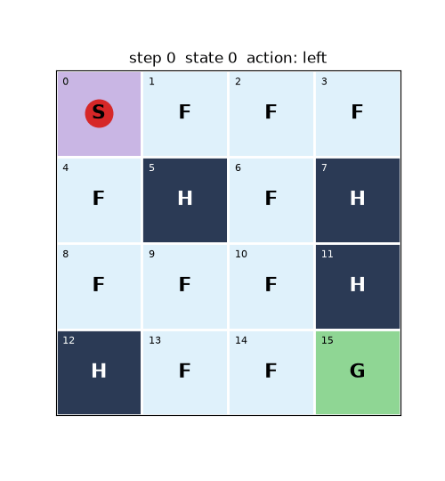

# Q-learning（FrozenLake）

表格型 Q-learning，环境为 Gymnasium `FrozenLake-v1`。

| 文件 | 内容 |
|---|---|
| [basic.md](basic.md) | 前置概念：MDP、 $Q^\star$ 、贝尔曼方程、TD 更新、ε-greedy |
| [task.md](task.md) | 任务说明与验收标准 |
| [model.md](model.md) | 结合 basic 讲解 Q-learning 算法与代码对应关系 |

## 运行

```bash
pip install -r requirements.txt
```

```bash
python main.py
```

```bash
python main.py --no-slippery
```

结果保存在 `outputs/`：`task.png`、`episode.gif`、`q_table.npy`、`training_curve.png`、`policy.png`。




